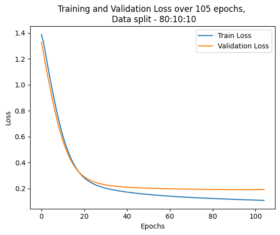

# Solution for Problem 4 - Facebook Large Page-Page Network Dataset

## Dataset Information

This repository contains the solution for Problem 4 of the assignment, which involves analysing the Facebook Large Page-Page Network Dataset. The dataset can be found at the following link: [Facebook Large Page-Page Network Dataset](https://snap.stanford.edu/data/facebook-large-page-page-network.html).

The original dataset to be used as outlined in the spec sheet was in a .npz file, which had simplified features reduced to 128 dimensions. However, this file was unavailable. Instead, the raw dataset in csv format was used, which did not have an impact on performance or training times.The dataset consists of three csv files: `musae_facebook_edges.csv`, `musae_facebook_target.csv`, and `musae_facebook_features.csv`. The edges file contains the connections between nodes, the target file contains the labels for each node, and the features file contains the feature vectors for each node.  Minimal preprocessing was performed, outside of converting the csv files into a graph structure, outside of splitting the data into training, validation, and test sets using masking.


## Model Description

The model used for this problem is a Graph Neural Network (GNN) implemented using the PyTorch Geometric library. The architecture consists of two graph convolutional layers using a ReLu layer in between.Originally the plan was to use a more complicated architecture with more layers but this simple architecture worked quite well upon initial creation and testing so it was kept.

### GCN Architecture

At a high the level, a graph convolutional network (GCN) works by learning patterns from a labelled data point and using its features (which includes information about the node itself as well as its neighbours) to predict the labels of unlabelled data points. The GCN layers aggregate information from a node's local neighbourhood, allowing the model to learn representations that capture both node features and graph structure.


The mathematical operation of my GCN can be summarised as follows:

$$
Z=\^A(ReLU(A^XW^{(0)}))W^{(1)}
$$

Where:

- \(X\) is the input feature matrix of shape (num_nodes, num_features)
- \(W^{(0)}\) and \(W^{(1)}\) are the weight matrices for the first and second GCN layers, respectively
- \(A\) is the normalized adjacency. This is calculated internally by the PyTorch Geometric GCNConv layer.
- \(ReLU\) is the activation function applied after the first GCN layer
- \(Z\) is the output matrix of shape (num_nodes, num_classes), which contains the logits for each class for each node

There is also an implicit softmax operation wrapped around the output during training to convert the logits into probabilities for each class.

## Usage Instructions

Download the dataset from the provided link and place it in the same directory as the code files. Ensure that the file names are not changed from the source, and that the files are formatted as such:

```text
facebook
├── musae_facebook_edges.csv
├──musae_facebook_target.csv
└──musae_facebook_features.csv
```

 Run the `train.py` script to train the model. After training, use the `predict.py` script to evaluate the model on the test set and visualise the results. Alternatively, you can run the `train.ipynb` and then `predict.ipynb` Jupyter notebooks to use Google Colab GPU resources.

Set config options in the `config.py` file as needed for file paths, and hyperparameters.

## Requirements

If using the python scripts, ensure that you have the required libraries installed. You can install them using pip:

```bash
pip install -r requirements.txt`
```

The required libraries include:

```bash
matplotlib
networkx
numpy
pandas
scikit_learn
torch
torch_geometric
```

These are automatically installed when using the Jupyter notebooks in Google Colab.

## Findings

Different combinations of data splits and learning rates were experimented with, however the initial test of 80:10:10 worked the best, along with a learning rate of 0.01. This configuration yielded the highest accuracy on the test set of 94.88 percent.


### Configurations and Results

The table below summarises the different configurations tested and their corresponding accuracies on the test set. I used a random seed for each as using the same seed led to similar results across different configurations. The Adam optimiser was used for all configurations.

| Train:Val:Test Ratio | Learning Rate | Test Set Accuracy (%) | Epochs until Validation Buffer Reached |
|----------------------|---------------|-----------------------|----------------------|
|60:20:20 |0.01  |94.93| 95 |
|60:20:20 |0.1 | 95.55| 54|
|70:15:15 |0.01 |94.93 | 115|
|70:15:15 |0.1 | 94.84 | 35|
|80:10:10 |0.01 | 95.42 | 136|
|80:10:10 |0.1 | 94.44 | 43|

Interestingly, the learning rate of 0.1 generally led to faster convergence but very slightly lower accuracy. The 80:10:10 split with a learning rate of 0.01 provided the best test accuracy, and since time is not an issue due to the lower complexity of the data, we can afford to have more epochs.

The graph below shows the training and validation loss over epochs for the best model configuration (80:10:10 split with a learning rate of 0.01). The model converges well, with both training and validation losses decreasing steadily over epochs. Early stopping was employed based on validation loss to prevent overfitting, which is why the model only trained for 105 epochs before stopping. This training was done without a constant seed which is why the epoch count differs from the table above.



The scatter plot below shows the t-SNE visualisation of the node embeddings learned by the GNN model. Each color represents a different class label. The visualisation indicates that the model has learned to cluster nodes of the same class together effectively, with distinct separations between different classes and only a few misclassifications. The groups are also well defined, indicating that the model has learned meaningful representations of the nodes in the graph.


## Project note

Lots of OOP was used in this project to keep the code modular and reusable. Maybe more than necessary but I still wanted to do it like this, especially since I was working with Colab and for fun. Also, due to my PC having issues with running this code locally, the functionality on predict.py and train.py was not tested, but it should work as intended.

## References

